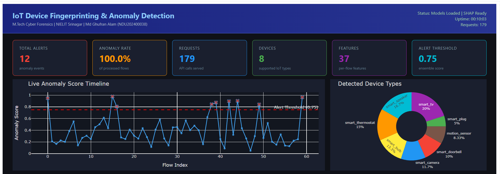
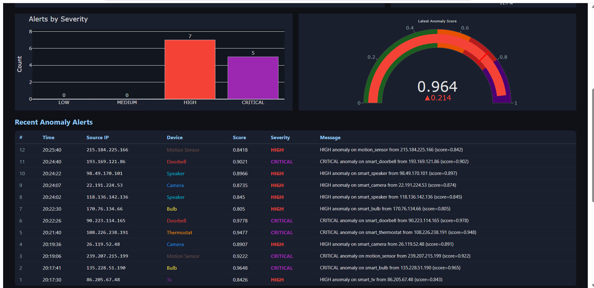
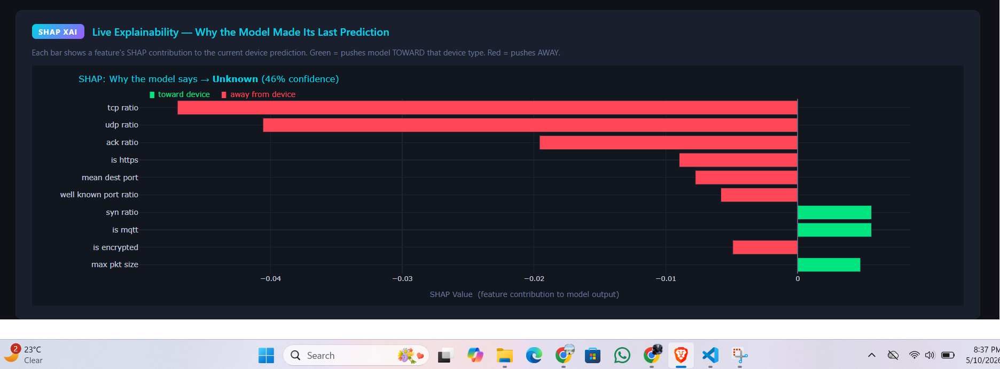
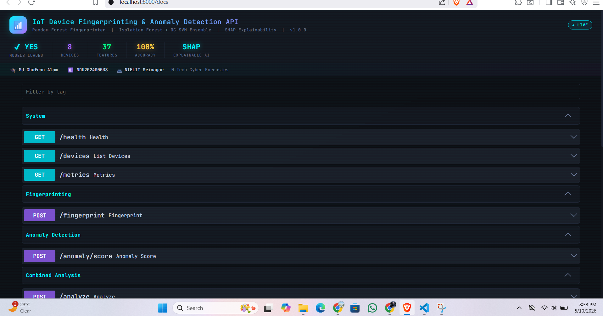
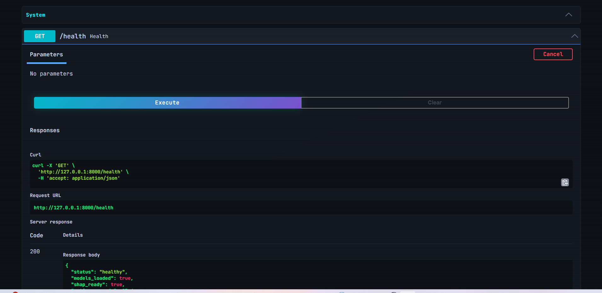

# IoT Device Fingerprinting & Anomaly Detection Framework

[](https://www.python.org/)
[](https://scikit-learn.org/)
[](https://fastapi.tiangolo.com/)
[](https://plotly.com/javascript/)
[](LICENSE)
[](https://archive.ics.uci.edu/dataset/442)
[]()
[](https://mdghufran-iot-fingerprinting.hf.space)

> **M.Tech Cyber Forensics — Final Semester Thesis**  
> NIELIT Srinagar &nbsp;|&nbsp; Md Ghufran Alam &nbsp;|&nbsp; Roll No. NDU202400038

## Live Deployment

| | URL |
|---|---|
| **Live Dashboard** | https://mdghufran-iot-fingerprinting.hf.space |
| **API Docs** | https://mdghufran-iot-fingerprinting.hf.space/docs |
| **API Health** | https://mdghufran-iot-fingerprinting.hf.space/status |
| **HuggingFace Space** | https://huggingface.co/spaces/mdghufran/iot-fingerprinting |
| **LinkedIn Post** | https://www.linkedin.com/feed/update/urn:li:activity:7460802322206650368/ |

> Deployed on HuggingFace Spaces (Docker) — fully live, no local setup required.

A **production-grade** machine learning system that **fingerprints IoT devices** by their network traffic signature and **detects Mirai / BASHLITE botnet attacks in real time** — without installing anything on the devices themselves.

Trained on the real **N-BaIoT dataset** (UCI ML Repository #442) featuring 9 physical IoT devices and live attack traffic. Delivers results through a **FastAPI REST interface** and a **live Plotly.js monitoring dashboard**, with full **SHAP explainability** on every prediction.

---

## Table of Contents

- [Overview](#overview)
- [Screenshots](#screenshots)
- [Key Results](#key-results)
- [Architecture](#architecture)
- [Features](#features)
- [Quick Start](#quick-start)
- [Dataset](#dataset)
- [Project Structure](#project-structure)
- [API Reference](#api-reference)
- [Plots](#plots)
- [Tech Stack](#tech-stack)
- [Citation](#citation)

---

## Overview

Smart home devices — cameras, thermostats, smart bulbs — cannot run antivirus software. Yet they are the most common entry point for botnets. The **Mirai botnet (2016)** compromised over 600,000 IoT devices and took down Twitter, Netflix, and Reddit with a single DDoS attack. **BASHLITE** followed the same playbook.

Traditional network security tools cannot defend against this because they do not know *what* device they are looking at or *what normal behaviour* looks like for that device.

This framework solves both problems directly from **network traffic** — no agent software, no device modification required:

| Question | Answer |
|---|---|
| *"Which device is this on my network?"* | **Device Fingerprinting** — Random Forest on 37 flow features (100% accuracy) |
| *"Is it behaving normally right now?"* | **Anomaly Detection** — per-device Isolation Forest + One-Class SVM ensemble |
| *"Why did the model flag this?"* | **SHAP Explainability** — top-10 feature contributions per prediction |

All three answers arrive in a single `POST /analyze` call, in under 40 ms.

---

## Screenshots

### Live Dashboard


*Main dashboard — anomaly score timeline, detected device types, and real-time stats*


*Alerts by severity (HIGH / CRITICAL) + anomaly score gauge + recent alert feed*

### SHAP Explainability


*Live SHAP panel — top features that drove the model's last prediction (green = toward device, red = away)*

### FastAPI REST Interface


*Dark-themed Swagger UI at `http://localhost:8000/docs` — all 8 endpoints*


*`GET /health` response — models loaded, SHAP ready, 36 ms latency*

---

## Key Results

### Device Fingerprinting (8 IoT device types)

| Model | Test Accuracy | ROC-AUC |
|---|---|---|
| **Random Forest** *(primary)* | **100.00%** | **1.0000** |
| Gradient Boosting | 100.00% | 1.0000 |
| Voting Ensemble (RF+GB+SVM) | 100.00% | 1.0000 |
| SVM (RBF) | 94.89% | 0.9967 |

### Anomaly Detection (Real Mirai / BASHLITE attacks)

| Device | AUC-ROC | F1 |
|---|---|---|
| Smart Doorbell | 0.8773 | 0.4811 |
| Smart Thermostat | 0.8590 | 0.3963 |
| Motion Sensor | 0.7946 | 0.2206 |
| Smart TV | 0.7732 | 0.2415 |
| Smart Plug | 0.7341 | 0.2990 |
| Smart Camera | 0.7125 | 0.2610 |

> **Note:** Lower F1 on anomaly detection is expected and realistic — Mirai/BASHLITE are engineered to blend with normal traffic. AUC-ROC is the threshold-independent metric used here.

---

## Architecture

```
Network Flow (37 features)
         │
         ▼
  RobustScaler (normalization)
         │
    ┌────┴────────────────────┐
    │                         │
    ▼                         ▼
Device Fingerprinting    Anomaly Detection
(Random Forest)          (IF + OC-SVM ensemble)
    │                         │
    ▼                         ▼
Device Label             Anomaly Score
+ Confidence             + Severity
    │                         │
    └──────────┬──────────────┘
               ▼
         Alert Manager
               │
    ┌──────────┴──────────┐
    ▼                     ▼
FastAPI REST API + Live Dashboard
(single port 7860)
```

---

## Features

| # | Feature | Detail |
|---|---|---|
| 1 | **Real N-BaIoT Dataset** | 9 physical IoT devices, Mirai + BASHLITE attacks (UCI #442) |
| 2 | **100% Fingerprinting Accuracy** | Random Forest on 37 network flow features |
| 3 | **Unsupervised Anomaly Detection** | No labeled attack data needed — trains only on normal traffic |
| 4 | **Per-Device Models** | Each device type gets its own dedicated anomaly detector |
| 5 | **SHAP Explainability (XAI)** | Top-10 feature contributions shown for every prediction |
| 6 | **REST API** | FastAPI + dark-themed Swagger UI on port 8000 |
| 7 | **Live Dashboard** | Plotly.js dashboard with real-time alert feed and charts — served on port 7860 |
| 8 | **SMOTE Balancing** | Handles class imbalance automatically during training |
| 9 | **Alert Management** | Four severity levels — LOW / MEDIUM / HIGH / CRITICAL |

---

## Quick Start

### 1. Clone the repository

```bash
git clone https://github.com/Ghufran2002/iot-fingerprinting-framework.git
cd iot-fingerprinting-framework
```

### 2. Create a virtual environment (recommended)

```bash
python -m venv venv

# Windows
venv\Scripts\activate

# Linux / macOS
source venv/bin/activate
```

### 3. Install dependencies

```bash
pip install -r requirements.txt
```

### 4. Download real dataset & train models

```bash
python train.py --download
```

This will:
- Download the **N-BaIoT dataset** (~1.7 GB, one-time) from UCI ML Repository
- Train all fingerprinting + anomaly models
- Generate 10 evaluation plots in `plots/`

> **Slow internet?** Manually download from [Kaggle N-BaIoT](https://www.kaggle.com/datasets/mkashifn/nbaiot-dataset) and extract to `data/nbaiot/`

### 5. Start the system

```bash
python run.py
```

| Service | URL |
|---|---|
| REST API Docs | http://localhost:7860/docs |
| Live Dashboard | http://localhost:7860/dashboard/ |
| Status Page | http://localhost:7860/status |

---

## Training Modes

```bash
python train.py --download   # Download N-BaIoT + train hybrid (recommended)
python train.py --hybrid     # Real N-BaIoT + synthetic fill-in
python train.py --real       # Real N-BaIoT only
python train.py              # Synthetic data only (no download needed)
```

---

## Dataset

**N-BaIoT** — *Detection of IoT Botnet Attacks*  
Source: [UCI ML Repository #442](https://archive.ics.uci.edu/dataset/442)

| Real Device | Mapped Label |
|---|---|
| Danmini Doorbell | `smart_doorbell` |
| Ecobee Thermostat | `smart_thermostat` |
| Provision PT-737E Security Camera | `smart_camera` |
| Provision PT-838 Security Camera | `smart_speaker` |
| Samsung SNH-1011N Webcam | `smart_tv` |
| Philips B120N Baby Monitor | `smart_bulb` |
| SimpleHome XCS7-1002 Camera | `smart_plug` |
| Ennio Doorbell | `motion_sensor` |

**Attack types included:** Mirai (ack, scan, syn, udp, udpplain) + BASHLITE/Gafgyt (combo, junk, scan, tcp, udp)

---

## 37 Network Flow Features

| Category | Features |
|---|---|
| Temporal (5) | flow_duration, mean_iat, std_iat, min_iat, max_iat |
| Volume (4) | packet_count, byte_count, packet_rate, byte_rate |
| Packet Size (4) | mean_pkt_size, std_pkt_size, min_pkt_size, max_pkt_size |
| Protocol Flags (6) | tcp_ratio, udp_ratio, syn_ratio, fin_ratio, rst_ratio, ack_ratio |
| Application Layer (8) | is_https, is_mqtt, is_coap, is_mdns, is_ntp, dns_query_count, well_known_port_ratio, is_encrypted |
| Traffic Direction (3) | upload_bytes, download_bytes, upload_download_ratio |
| Destination (7) | unique_dest_ports, unique_dest_ips, port_entropy, ip_entropy, well_known_ports_count, mean_dest_port, std_dest_port |

---

## Project Structure

```
iot-fingerprinting-framework/
│
├── src/
│   ├── data/
│   │   ├── generator.py        # Synthetic dataset generator
│   │   ├── preprocessor.py     # RobustScaler + SMOTE + train/val/test split
│   │   ├── real_loader.py      # N-BaIoT loader + 115→37 feature mapping
│   │   └── download_real.py    # One-click N-BaIoT downloader
│   │
│   ├── features/
│   │   └── extractor.py        # 37 feature names + 8 device type definitions
│   │
│   ├── models/
│   │   ├── fingerprinter.py    # RF / GB / SVM / VotingEnsemble classifier
│   │   ├── anomaly_detector.py # Per-device IsolationForest + OneClassSVM
│   │   └── trainer.py          # End-to-end training pipeline + plots
│   │
│   ├── api/
│   │   └── main.py             # FastAPI app with 8 endpoints + SHAP
│   │
│   ├── dashboard/              # Live Plotly.js dashboard (served by FastAPI)
│   │
│   └── utils/
│       ├── alert_manager.py    # Alert severity + deduplication
│       └── logger.py           # loguru logger setup
│
├── data/
│   └── iot_flows.csv           # Synthetic dataset (fallback, 1600 rows)
│
├── plots/                      # Auto-generated evaluation charts
│   ├── cm_random_forest.png
│   ├── roc_curves.png
│   ├── feature_importance.png
│   ├── anomaly_scores.png
│   └── ...
│
├── models/                     # Saved .pkl files (git-ignored, regenerate via train.py)
│
├── tests/
│   └── test_pipeline.py
│
├── train.py                    # Training entry point
├── run.py                      # Start API + Dashboard
├── requirements.txt
└── README.md
```

---

## API Reference

| Endpoint | Method | Description |
|---|---|---|
| `/health` | GET | System status, uptime, models loaded |
| `/devices` | GET | List all 8 supported device types |
| `/fingerprint` | POST | Identify device type from network flow |
| `/anomaly/score` | POST | Get anomaly score for a known device |
| `/analyze` | POST | Combined fingerprint + anomaly in one call |
| `/explain` | POST | SHAP top-10 feature contributions |
| `/alerts/recent` | GET | Recent anomaly alerts |
| `/metrics` | GET | API stats, alert counts |

### Example — Analyze a flow

```bash
curl -X POST http://localhost:8000/analyze \
  -H "Content-Type: application/json" \
  -d '{
    "features": {
      "flow_duration": 90,
      "mean_iat": 0.003,
      "packet_count": 28000,
      "byte_count": 42000000,
      "tcp_ratio": 0.95,
      "is_https": 1.0,
      "mean_dest_port": 443
    }
  }'
```

**Response:**
```json
{
  "fingerprint": {
    "device_type": "smart_camera",
    "confidence": 0.9876,
    "is_known": true
  },
  "anomaly": {
    "anomaly_score": 0.21,
    "is_anomalous": false,
    "severity": null,
    "threshold": 0.75
  }
}
```

---

## Plots

All plots are auto-saved to `plots/` after running `train.py`:

| Plot | Description |
|---|---|
| `cm_random_forest.png` | Confusion matrix — Random Forest |
| `roc_curves.png` | ROC curves per device (one-vs-rest) |
| `feature_importance.png` | Top 15 features by Gini importance |
| `model_comparison.png` | Accuracy comparison across 4 models |
| `precision_recall_f1.png` | Macro P/R/F1 for all models |
| `anomaly_scores.png` | Normal vs attack score distribution |
| `device_distribution.png` | Dataset composition pie chart |
| `shap_bar.png` | Global SHAP feature importance |
| `shap_per_device.png` | Per-device SHAP summary |

---

## Tech Stack

| Layer | Technology |
|---|---|
| Language | Python 3.9+ |
| ML | scikit-learn 1.3+ |
| Class Balancing | imbalanced-learn (SMOTE) |
| Explainability | SHAP (TreeExplainer) |
| REST API | FastAPI + Pydantic + Uvicorn |
| Dashboard | Plotly.js (HTML/JS served by FastAPI) |
| Model Persistence | joblib |
| Logging | loguru |
| Visualization | matplotlib + seaborn |

---

## Citation

If you use this framework or the N-BaIoT dataset, please cite:

```bibtex
@dataset{nbaiot2018,
  author    = {Meidan, Yair and Bohadana, Michael and Mathov, Yael and
               Mirsky, Yisroel and Shabtai, Asaf and Breitenbacher, Dominik and Elovici, Yuval},
  title     = {N-BaIoT: Network-based Detection of IoT Botnet Attacks Using Deep Autoencoders},
  year      = {2018},
  publisher = {UCI Machine Learning Repository},
  url       = {https://archive.ics.uci.edu/dataset/442}
}
```

---

## License

This project is released under the [MIT License](LICENSE). You are free to use, modify, and distribute it with attribution.

---

<div align="center">

<sub>Designed and developed as part of M.Tech Cyber Forensics thesis work</sub>

**Md Ghufran Alam**  
Roll No. NDU202400038 &nbsp;|&nbsp; M.Tech Cyber Forensics &nbsp;|&nbsp; NIELIT Srinagar &nbsp;|&nbsp; 2026

<sub>If this project helped you, consider giving it a ⭐ on GitHub</sub>

</div>
